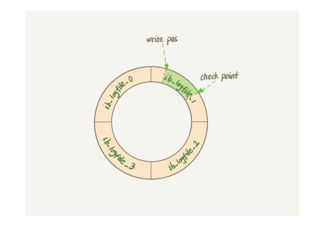

## redo log（InnoDB引擎层特有）

**redo log 是固定大小的（比如4g），从头开始写，写到末尾又循环到开头写，**

write pos 是当前记录的位置，一边写一边后移，写到第 3 号文件末尾后就回到 0 号文件开头。checkpoint 是当前要擦除的位置，也是往后推移并且循环的，擦除记录前要把记录更新到数据文件。
 
当redo log满了，就不能再执行更新，得停下来擦掉一些记录，把checkpoint推进一下

**有了redo log，InnoDB就可以保证即使数据库异常重启，之前提交的记录也不会丢**

## binlog（Mysql服务层日志）
binlog有两种模式，statement 格式的话是记sql语句， row格式会记录行的内容，记两条，更新前和更新后都有。

**redo log是InnoDB引擎特有的，而binlog是Mysql服务端的**
**redo log是物理日志，比如在某个数据页做了什么修改，binlog是逻辑日志，记录的是这个语句的原始逻辑，比如给ID=2这一行的a字段+1**
**redo log是循环写的，空间固定会用完，binlog是追加写入的，当文件写定一定大小会切换到下一个文件**

## 如何保证两个日志的一致性
先写redolog，处于prepare阶段，等写完binlog再commit

## 为什么binlog没有crash-safe的能力
因为redolog记录的是未刷入磁盘的数据，而binlog记录的是全量的日志，并不知道哪些内容还没有落库
